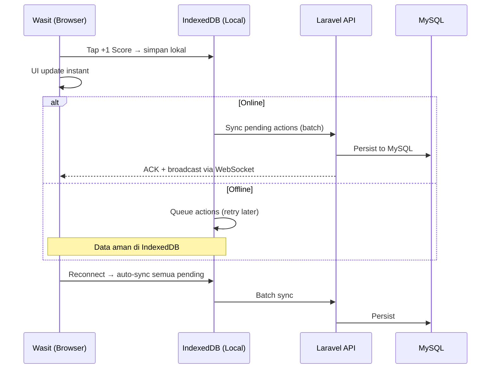
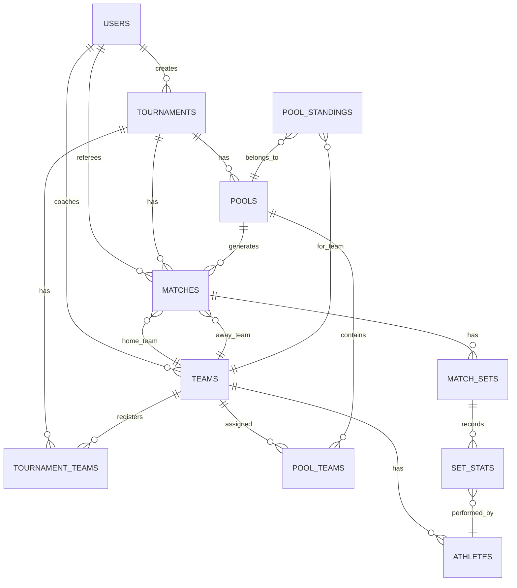

# Takraw UNJ App — Database Schema & Tech Stack

## 1. Rekomendasi Tech Stack

Berdasarkan environment Laragon yang sudah terinstal dan kebutuhan PRD (mobile-first, offline resilience, real-time scoring), berikut rekomendasi tech stack:

| Layer | Teknologi | Alasan |
|---|---|---|
| **Backend** | **Laravel 11 (PHP 8.3)** | Sudah terintegrasi sempurna dengan Laragon. Eloquent ORM, built-in Auth, Queue, Broadcasting, Excel import via `maatwebsite/excel`. |
| **Database** | **MySQL 8.0** | Default Laragon; relational, cocok untuk struktur turnamen yang highly relational. |
| **Frontend** | **React 18 + Inertia.js** | SPA experience tanpa perlu API terpisah. Komponen reusable untuk UI scoring wasit. |
| **Styling** | **Tailwind CSS 3** | Utility-first, cepat iterasi UI mobile-first. |
| **Real-time** | **Laravel Reverb** (WebSocket) | Native Laravel WebSocket server, zero cost, push skor live ke dashboard. |
| **Offline** | **Service Worker + IndexedDB** (via `idb` library) | Data scoring tersimpan lokal di browser wasit → auto-sync saat online. |
| **PWA** | **Vite PWA Plugin** | Agar wasit bisa "install" app ke home screen HP tanpa Play Store. |
| **Excel Import** | **Maatwebsite Laravel Excel** | Import `.xlsx`/`.csv` untuk registrasi tim batch. |
| **PDF Report** | **DomPDF** atau **Snappy** | Generate laporan performa downloadable. |
| **Auth** | **Laravel Breeze + Spatie Permission** | Multi-role (Admin, Pelatih, Wasit) dengan middleware guard. |

### Arsitektur Offline-First untuk Wasit



---

## 2. Database Schema (MySQL 8.0)

### Entity Relationship Diagram



### Tabel Detail

> [!NOTE]
> Semua tabel menggunakan `BIGINT UNSIGNED AUTO_INCREMENT` untuk primary key, `timestamps` (created_at, updated_at), dan `soft_deletes` (deleted_at) secara default via Laravel migration convention.

---

#### `users`
Tabel otentikasi multi-role (Admin, Coach, Referee).

| Column | Type | Constraint | Keterangan |
|---|---|---|---|
| `id` | BIGINT UNSIGNED | PK, AI | |
| `name` | VARCHAR(100) | NOT NULL | Nama lengkap |
| `email` | VARCHAR(150) | UNIQUE, NOT NULL | Login email |
| `password` | VARCHAR(255) | NOT NULL | Bcrypt hash |
| `role` | ENUM('admin','coach','referee') | NOT NULL, DEFAULT 'coach' | Role utama |
| `phone` | VARCHAR(20) | NULLABLE | Nomor HP |
| `is_active` | BOOLEAN | DEFAULT TRUE | Akun aktif/nonaktif |
| `created_at` | TIMESTAMP | | |
| `updated_at` | TIMESTAMP | | |
| `deleted_at` | TIMESTAMP | NULLABLE | Soft delete |

---

#### `tournaments`
Sesi turnamen yang dibuat oleh Admin.

| Column | Type | Constraint | Keterangan |
|---|---|---|---|
| `id` | BIGINT UNSIGNED | PK, AI | |
| `name` | VARCHAR(150) | NOT NULL | Nama turnamen |
| `start_date` | DATE | NOT NULL | Tanggal mulai |
| `end_date` | DATE | NOT NULL | Tanggal berakhir |
| `mode` | ENUM('regu','double','quarter') | NOT NULL | Mode takraw (jumlah pemain) |
| `status` | ENUM('draft','registration','pool_stage','bracket_stage','completed') | DEFAULT 'draft' | Status turnamen |
| `created_by` | BIGINT UNSIGNED | FK → users.id | Admin pembuat |
| `created_at` | TIMESTAMP | | |
| `updated_at` | TIMESTAMP | | |
| `deleted_at` | TIMESTAMP | NULLABLE | |

**Index:** `idx_tournaments_status` on (`status`)

---

#### `teams`
Tim yang terdaftar, dikelola oleh Coach atau Admin.

| Column | Type | Constraint | Keterangan |
|---|---|---|---|
| `id` | BIGINT UNSIGNED | PK, AI | |
| `name` | VARCHAR(100) | NOT NULL | Nama tim |
| `region` | VARCHAR(100) | NOT NULL | Nama daerah |
| `coach_id` | BIGINT UNSIGNED | FK → users.id, NULLABLE | Pelatih penanggung jawab |
| `created_at` | TIMESTAMP | | |
| `updated_at` | TIMESTAMP | | |
| `deleted_at` | TIMESTAMP | NULLABLE | |

---

#### `athletes`
Daftar atlet per tim.

| Column | Type | Constraint | Keterangan |
|---|---|---|---|
| `id` | BIGINT UNSIGNED | PK, AI | |
| `team_id` | BIGINT UNSIGNED | FK → teams.id | Tim induk |
| `name` | VARCHAR(100) | NOT NULL | Nama atlet |
| `jersey_number` | SMALLINT UNSIGNED | NOT NULL | No punggung |
| `position` | VARCHAR(50) | NULLABLE | Posisi pemain (tekong, feeder, killer, dsb) |
| `created_at` | TIMESTAMP | | |
| `updated_at` | TIMESTAMP | | |

**Unique:** `uq_athlete_jersey` on (`team_id`, `jersey_number`) — satu tim tidak boleh ada nomor punggung ganda.

---

#### `tournament_teams`
Pivot tabel: tim yang terdaftar di turnamen tertentu.

| Column | Type | Constraint | Keterangan |
|---|---|---|---|
| `id` | BIGINT UNSIGNED | PK, AI | |
| `tournament_id` | BIGINT UNSIGNED | FK → tournaments.id | |
| `team_id` | BIGINT UNSIGNED | FK → teams.id | |
| `registered_at` | TIMESTAMP | DEFAULT CURRENT_TIMESTAMP | Waktu registrasi |

**Unique:** `uq_tournament_team` on (`tournament_id`, `team_id`)

---

#### `pools`
Pool/grup babak penyisihan.

| Column | Type | Constraint | Keterangan |
|---|---|---|---|
| `id` | BIGINT UNSIGNED | PK, AI | |
| `tournament_id` | BIGINT UNSIGNED | FK → tournaments.id | |
| `name` | VARCHAR(10) | NOT NULL | Label pool: "A", "B", "C", dst |
| `created_at` | TIMESTAMP | | |
| `updated_at` | TIMESTAMP | | |

**Unique:** `uq_pool_name` on (`tournament_id`, `name`)

---

#### `pool_teams`
Pivot tabel: tim yang masuk ke pool tertentu.

| Column | Type | Constraint | Keterangan |
|---|---|---|---|
| `id` | BIGINT UNSIGNED | PK, AI | |
| `pool_id` | BIGINT UNSIGNED | FK → pools.id | |
| `team_id` | BIGINT UNSIGNED | FK → teams.id | |

**Unique:** `uq_pool_team` on (`pool_id`, `team_id`)

---

#### `pool_standings`
Klasemen pool (dihitung/di-cache untuk performa query).

| Column | Type | Constraint | Keterangan |
|---|---|---|---|
| `id` | BIGINT UNSIGNED | PK, AI | |
| `pool_id` | BIGINT UNSIGNED | FK → pools.id | |
| `team_id` | BIGINT UNSIGNED | FK → teams.id | |
| `played` | SMALLINT UNSIGNED | DEFAULT 0 | Jumlah match dimainkan |
| `won` | SMALLINT UNSIGNED | DEFAULT 0 | Menang |
| `lost` | SMALLINT UNSIGNED | DEFAULT 0 | Kalah |
| `sets_won` | SMALLINT UNSIGNED | DEFAULT 0 | Total set menang |
| `sets_lost` | SMALLINT UNSIGNED | DEFAULT 0 | Total set kalah |
| `points_for` | INT UNSIGNED | DEFAULT 0 | Total poin dicetak |
| `points_against` | INT UNSIGNED | DEFAULT 0 | Total poin kemasukan |
| `rank` | SMALLINT UNSIGNED | NULLABLE | Peringkat di pool (1, 2, 3...) |
| `updated_at` | TIMESTAMP | | |

**Unique:** `uq_pool_standing` on (`pool_id`, `team_id`)

---

#### `matches`
Setiap pertandingan (pool maupun bracket).

| Column | Type | Constraint | Keterangan |
|---|---|---|---|
| `id` | BIGINT UNSIGNED | PK, AI | |
| `tournament_id` | BIGINT UNSIGNED | FK → tournaments.id | |
| `pool_id` | BIGINT UNSIGNED | FK → pools.id, NULLABLE | NULL jika babak bracket |
| `stage` | ENUM('pool','quarterfinal','semifinal','third_place','final') | NOT NULL | Tahap kompetisi |
| `bracket_position` | SMALLINT UNSIGNED | NULLABLE | Posisi di bagan bracket (untuk sorting visual) |
| `home_team_id` | BIGINT UNSIGNED | FK → teams.id, NULLABLE | Tim kiri (bisa NULL jika BYE) |
| `away_team_id` | BIGINT UNSIGNED | FK → teams.id, NULLABLE | Tim kanan |
| `referee_id` | BIGINT UNSIGNED | FK → users.id, NULLABLE | Wasit yang ditugaskan |
| `court_number` | SMALLINT UNSIGNED | NULLABLE | Nomor lapangan (diisi wasit) |
| `max_sets` | SMALLINT UNSIGNED | DEFAULT 3 | Best of N (diisi wasit) |
| `winner_team_id` | BIGINT UNSIGNED | FK → teams.id, NULLABLE | Pemenang match |
| `next_match_id` | BIGINT UNSIGNED | FK → matches.id, NULLABLE | Match bracket selanjutnya (self-ref) |
| `status` | ENUM('scheduled','setup','live','finished') | DEFAULT 'scheduled' | Status match |
| `scheduled_at` | DATETIME | NULLABLE | Jadwal main |
| `started_at` | DATETIME | NULLABLE | Waktu kick-off |
| `finished_at` | DATETIME | NULLABLE | Waktu selesai |
| `created_at` | TIMESTAMP | | |
| `updated_at` | TIMESTAMP | | |

**Index:** `idx_matches_tournament_stage` on (`tournament_id`, `stage`)  
**Index:** `idx_matches_referee` on (`referee_id`)  
**Index:** `idx_matches_status` on (`status`)

> [!TIP]
> Kolom `next_match_id` (self-referencing FK) memungkinkan sistem secara otomatis menggeser pemenang ke babak selanjutnya di bracket. Saat wasit menyelesaikan match, trigger/logic di backend mengisi `home_team_id` atau `away_team_id` pada match berikutnya.

---

#### `match_sets`
Setiap set dalam satu match.

| Column | Type | Constraint | Keterangan |
|---|---|---|---|
| `id` | BIGINT UNSIGNED | PK, AI | |
| `match_id` | BIGINT UNSIGNED | FK → matches.id | |
| `set_number` | SMALLINT UNSIGNED | NOT NULL | Set ke-1, 2, 3, dst |
| `home_score` | SMALLINT UNSIGNED | DEFAULT 0 | Skor akhir tim kiri |
| `away_score` | SMALLINT UNSIGNED | DEFAULT 0 | Skor akhir tim kanan |
| `winner_team_id` | BIGINT UNSIGNED | FK → teams.id, NULLABLE | Pemenang set |
| `status` | ENUM('pending','live','finished') | DEFAULT 'pending' | |
| `started_at` | DATETIME | NULLABLE | |
| `finished_at` | DATETIME | NULLABLE | |
| `created_at` | TIMESTAMP | | |
| `updated_at` | TIMESTAMP | | |

**Unique:** `uq_match_set` on (`match_id`, `set_number`)

---

#### `set_stats`
⭐ **Tabel inti** — statistik per atlet per set. Satu baris = performa satu atlet di satu set.

| Column | Type | Constraint | Keterangan |
|---|---|---|---|
| `id` | BIGINT UNSIGNED | PK, AI | |
| `match_set_id` | BIGINT UNSIGNED | FK → match_sets.id | |
| `athlete_id` | BIGINT UNSIGNED | FK → athletes.id | |
| `team_id` | BIGINT UNSIGNED | FK → teams.id | Denormalisasi untuk query cepat |
| `service_in` | SMALLINT UNSIGNED | DEFAULT 0 | |
| `service_ace` | SMALLINT UNSIGNED | DEFAULT 0 | |
| `service_error` | SMALLINT UNSIGNED | DEFAULT 0 | |
| `receive_success` | SMALLINT UNSIGNED | DEFAULT 0 | First Ball berhasil |
| `receive_fail` | SMALLINT UNSIGNED | DEFAULT 0 | First Ball gagal |
| `feeding_success` | SMALLINT UNSIGNED | DEFAULT 0 | |
| `feeding_fail` | SMALLINT UNSIGNED | DEFAULT 0 | |
| `strike_success` | SMALLINT UNSIGNED | DEFAULT 0 | Smash berhasil |
| `strike_fail` | SMALLINT UNSIGNED | DEFAULT 0 | Smash gagal |
| `block_success` | SMALLINT UNSIGNED | DEFAULT 0 | |
| `block_fail` | SMALLINT UNSIGNED | DEFAULT 0 | |
| `created_at` | TIMESTAMP | | |
| `updated_at` | TIMESTAMP | | |

**Unique:** `uq_set_athlete` on (`match_set_id`, `athlete_id`) — satu atlet hanya punya satu baris stat per set.  
**Index:** `idx_set_stats_team` on (`team_id`) — untuk aggregate query per tim.

> [!IMPORTANT]
> Design decision: Menggunakan **wide-column** (satu baris per atlet per set) alih-alih **EAV** (banyak baris per aksi) karena:
> 1. Jumlah metrik **tetap & terbatas** (12 kolom) → tidak perlu fleksibilitas EAV.
> 2. Query aggregate (`SUM`, `AVG`) jauh lebih cepat tanpa `PIVOT`.
> 3. Satu `UPDATE` per tap wasit (increment kolom) vs satu `INSERT` per tap di EAV → lebih ringan di mobile.
> 4. Ukuran baris kecil (~100 bytes) → caching-friendly.

---

### Full DDL (MySQL 8.0)

```sql
-- =====================================================
-- TAKRAW UNJ APP — DATABASE SCHEMA
-- Engine: MySQL 8.0 / InnoDB
-- =====================================================

CREATE TABLE `users` (
    `id` BIGINT UNSIGNED NOT NULL AUTO_INCREMENT,
    `name` VARCHAR(100) NOT NULL,
    `email` VARCHAR(150) NOT NULL,
    `password` VARCHAR(255) NOT NULL,
    `role` ENUM('admin','coach','referee') NOT NULL DEFAULT 'coach',
    `phone` VARCHAR(20) NULL,
    `is_active` BOOLEAN NOT NULL DEFAULT TRUE,
    `email_verified_at` TIMESTAMP NULL,
    `remember_token` VARCHAR(100) NULL,
    `created_at` TIMESTAMP NULL,
    `updated_at` TIMESTAMP NULL,
    `deleted_at` TIMESTAMP NULL,
    PRIMARY KEY (`id`),
    UNIQUE KEY `uq_users_email` (`email`)
) ENGINE=InnoDB DEFAULT CHARSET=utf8mb4 COLLATE=utf8mb4_unicode_ci;

CREATE TABLE `tournaments` (
    `id` BIGINT UNSIGNED NOT NULL AUTO_INCREMENT,
    `name` VARCHAR(150) NOT NULL,
    `start_date` DATE NOT NULL,
    `end_date` DATE NOT NULL,
    `mode` ENUM('regu','double','quarter') NOT NULL,
    `status` ENUM('draft','registration','pool_stage','bracket_stage','completed') NOT NULL DEFAULT 'draft',
    `created_by` BIGINT UNSIGNED NOT NULL,
    `created_at` TIMESTAMP NULL,
    `updated_at` TIMESTAMP NULL,
    `deleted_at` TIMESTAMP NULL,
    PRIMARY KEY (`id`),
    INDEX `idx_tournaments_status` (`status`),
    CONSTRAINT `fk_tournaments_creator` FOREIGN KEY (`created_by`) REFERENCES `users`(`id`)
) ENGINE=InnoDB DEFAULT CHARSET=utf8mb4 COLLATE=utf8mb4_unicode_ci;

CREATE TABLE `teams` (
    `id` BIGINT UNSIGNED NOT NULL AUTO_INCREMENT,
    `name` VARCHAR(100) NOT NULL,
    `region` VARCHAR(100) NOT NULL,
    `coach_id` BIGINT UNSIGNED NULL,
    `created_at` TIMESTAMP NULL,
    `updated_at` TIMESTAMP NULL,
    `deleted_at` TIMESTAMP NULL,
    PRIMARY KEY (`id`),
    CONSTRAINT `fk_teams_coach` FOREIGN KEY (`coach_id`) REFERENCES `users`(`id`) ON DELETE SET NULL
) ENGINE=InnoDB DEFAULT CHARSET=utf8mb4 COLLATE=utf8mb4_unicode_ci;

CREATE TABLE `athletes` (
    `id` BIGINT UNSIGNED NOT NULL AUTO_INCREMENT,
    `team_id` BIGINT UNSIGNED NOT NULL,
    `name` VARCHAR(100) NOT NULL,
    `jersey_number` SMALLINT UNSIGNED NOT NULL,
    `position` VARCHAR(50) NULL,
    `created_at` TIMESTAMP NULL,
    `updated_at` TIMESTAMP NULL,
    PRIMARY KEY (`id`),
    UNIQUE KEY `uq_athlete_jersey` (`team_id`, `jersey_number`),
    CONSTRAINT `fk_athletes_team` FOREIGN KEY (`team_id`) REFERENCES `teams`(`id`) ON DELETE CASCADE
) ENGINE=InnoDB DEFAULT CHARSET=utf8mb4 COLLATE=utf8mb4_unicode_ci;

CREATE TABLE `tournament_teams` (
    `id` BIGINT UNSIGNED NOT NULL AUTO_INCREMENT,
    `tournament_id` BIGINT UNSIGNED NOT NULL,
    `team_id` BIGINT UNSIGNED NOT NULL,
    `registered_at` TIMESTAMP NOT NULL DEFAULT CURRENT_TIMESTAMP,
    PRIMARY KEY (`id`),
    UNIQUE KEY `uq_tournament_team` (`tournament_id`, `team_id`),
    CONSTRAINT `fk_tt_tournament` FOREIGN KEY (`tournament_id`) REFERENCES `tournaments`(`id`) ON DELETE CASCADE,
    CONSTRAINT `fk_tt_team` FOREIGN KEY (`team_id`) REFERENCES `teams`(`id`) ON DELETE CASCADE
) ENGINE=InnoDB DEFAULT CHARSET=utf8mb4 COLLATE=utf8mb4_unicode_ci;

CREATE TABLE `pools` (
    `id` BIGINT UNSIGNED NOT NULL AUTO_INCREMENT,
    `tournament_id` BIGINT UNSIGNED NOT NULL,
    `name` VARCHAR(10) NOT NULL,
    `created_at` TIMESTAMP NULL,
    `updated_at` TIMESTAMP NULL,
    PRIMARY KEY (`id`),
    UNIQUE KEY `uq_pool_name` (`tournament_id`, `name`),
    CONSTRAINT `fk_pools_tournament` FOREIGN KEY (`tournament_id`) REFERENCES `tournaments`(`id`) ON DELETE CASCADE
) ENGINE=InnoDB DEFAULT CHARSET=utf8mb4 COLLATE=utf8mb4_unicode_ci;

CREATE TABLE `pool_teams` (
    `id` BIGINT UNSIGNED NOT NULL AUTO_INCREMENT,
    `pool_id` BIGINT UNSIGNED NOT NULL,
    `team_id` BIGINT UNSIGNED NOT NULL,
    PRIMARY KEY (`id`),
    UNIQUE KEY `uq_pool_team` (`pool_id`, `team_id`),
    CONSTRAINT `fk_pt_pool` FOREIGN KEY (`pool_id`) REFERENCES `pools`(`id`) ON DELETE CASCADE,
    CONSTRAINT `fk_pt_team` FOREIGN KEY (`team_id`) REFERENCES `teams`(`id`) ON DELETE CASCADE
) ENGINE=InnoDB DEFAULT CHARSET=utf8mb4 COLLATE=utf8mb4_unicode_ci;

CREATE TABLE `pool_standings` (
    `id` BIGINT UNSIGNED NOT NULL AUTO_INCREMENT,
    `pool_id` BIGINT UNSIGNED NOT NULL,
    `team_id` BIGINT UNSIGNED NOT NULL,
    `played` SMALLINT UNSIGNED NOT NULL DEFAULT 0,
    `won` SMALLINT UNSIGNED NOT NULL DEFAULT 0,
    `lost` SMALLINT UNSIGNED NOT NULL DEFAULT 0,
    `sets_won` SMALLINT UNSIGNED NOT NULL DEFAULT 0,
    `sets_lost` SMALLINT UNSIGNED NOT NULL DEFAULT 0,
    `points_for` INT UNSIGNED NOT NULL DEFAULT 0,
    `points_against` INT UNSIGNED NOT NULL DEFAULT 0,
    `rank` SMALLINT UNSIGNED NULL,
    `updated_at` TIMESTAMP NULL,
    PRIMARY KEY (`id`),
    UNIQUE KEY `uq_pool_standing` (`pool_id`, `team_id`),
    CONSTRAINT `fk_ps_pool` FOREIGN KEY (`pool_id`) REFERENCES `pools`(`id`) ON DELETE CASCADE,
    CONSTRAINT `fk_ps_team` FOREIGN KEY (`team_id`) REFERENCES `teams`(`id`) ON DELETE CASCADE
) ENGINE=InnoDB DEFAULT CHARSET=utf8mb4 COLLATE=utf8mb4_unicode_ci;

CREATE TABLE `matches` (
    `id` BIGINT UNSIGNED NOT NULL AUTO_INCREMENT,
    `tournament_id` BIGINT UNSIGNED NOT NULL,
    `pool_id` BIGINT UNSIGNED NULL,
    `stage` ENUM('pool','quarterfinal','semifinal','third_place','final') NOT NULL,
    `bracket_position` SMALLINT UNSIGNED NULL,
    `home_team_id` BIGINT UNSIGNED NULL,
    `away_team_id` BIGINT UNSIGNED NULL,
    `referee_id` BIGINT UNSIGNED NULL,
    `court_number` SMALLINT UNSIGNED NULL,
    `max_sets` SMALLINT UNSIGNED NOT NULL DEFAULT 3,
    `winner_team_id` BIGINT UNSIGNED NULL,
    `next_match_id` BIGINT UNSIGNED NULL,
    `status` ENUM('scheduled','setup','live','finished') NOT NULL DEFAULT 'scheduled',
    `scheduled_at` DATETIME NULL,
    `started_at` DATETIME NULL,
    `finished_at` DATETIME NULL,
    `created_at` TIMESTAMP NULL,
    `updated_at` TIMESTAMP NULL,
    PRIMARY KEY (`id`),
    INDEX `idx_matches_tournament_stage` (`tournament_id`, `stage`),
    INDEX `idx_matches_referee` (`referee_id`),
    INDEX `idx_matches_status` (`status`),
    CONSTRAINT `fk_matches_tournament` FOREIGN KEY (`tournament_id`) REFERENCES `tournaments`(`id`),
    CONSTRAINT `fk_matches_pool` FOREIGN KEY (`pool_id`) REFERENCES `pools`(`id`) ON DELETE SET NULL,
    CONSTRAINT `fk_matches_home` FOREIGN KEY (`home_team_id`) REFERENCES `teams`(`id`),
    CONSTRAINT `fk_matches_away` FOREIGN KEY (`away_team_id`) REFERENCES `teams`(`id`),
    CONSTRAINT `fk_matches_referee` FOREIGN KEY (`referee_id`) REFERENCES `users`(`id`) ON DELETE SET NULL,
    CONSTRAINT `fk_matches_winner` FOREIGN KEY (`winner_team_id`) REFERENCES `teams`(`id`),
    CONSTRAINT `fk_matches_next` FOREIGN KEY (`next_match_id`) REFERENCES `matches`(`id`) ON DELETE SET NULL
) ENGINE=InnoDB DEFAULT CHARSET=utf8mb4 COLLATE=utf8mb4_unicode_ci;

CREATE TABLE `match_sets` (
    `id` BIGINT UNSIGNED NOT NULL AUTO_INCREMENT,
    `match_id` BIGINT UNSIGNED NOT NULL,
    `set_number` SMALLINT UNSIGNED NOT NULL,
    `home_score` SMALLINT UNSIGNED NOT NULL DEFAULT 0,
    `away_score` SMALLINT UNSIGNED NOT NULL DEFAULT 0,
    `winner_team_id` BIGINT UNSIGNED NULL,
    `status` ENUM('pending','live','finished') NOT NULL DEFAULT 'pending',
    `started_at` DATETIME NULL,
    `finished_at` DATETIME NULL,
    `created_at` TIMESTAMP NULL,
    `updated_at` TIMESTAMP NULL,
    PRIMARY KEY (`id`),
    UNIQUE KEY `uq_match_set` (`match_id`, `set_number`),
    CONSTRAINT `fk_ms_match` FOREIGN KEY (`match_id`) REFERENCES `matches`(`id`) ON DELETE CASCADE,
    CONSTRAINT `fk_ms_winner` FOREIGN KEY (`winner_team_id`) REFERENCES `teams`(`id`)
) ENGINE=InnoDB DEFAULT CHARSET=utf8mb4 COLLATE=utf8mb4_unicode_ci;

CREATE TABLE `set_stats` (
    `id` BIGINT UNSIGNED NOT NULL AUTO_INCREMENT,
    `match_set_id` BIGINT UNSIGNED NOT NULL,
    `athlete_id` BIGINT UNSIGNED NOT NULL,
    `team_id` BIGINT UNSIGNED NOT NULL,
    `service_in` SMALLINT UNSIGNED NOT NULL DEFAULT 0,
    `service_ace` SMALLINT UNSIGNED NOT NULL DEFAULT 0,
    `service_error` SMALLINT UNSIGNED NOT NULL DEFAULT 0,
    `receive_success` SMALLINT UNSIGNED NOT NULL DEFAULT 0,
    `receive_fail` SMALLINT UNSIGNED NOT NULL DEFAULT 0,
    `feeding_success` SMALLINT UNSIGNED NOT NULL DEFAULT 0,
    `feeding_fail` SMALLINT UNSIGNED NOT NULL DEFAULT 0,
    `strike_success` SMALLINT UNSIGNED NOT NULL DEFAULT 0,
    `strike_fail` SMALLINT UNSIGNED NOT NULL DEFAULT 0,
    `block_success` SMALLINT UNSIGNED NOT NULL DEFAULT 0,
    `block_fail` SMALLINT UNSIGNED NOT NULL DEFAULT 0,
    `created_at` TIMESTAMP NULL,
    `updated_at` TIMESTAMP NULL,
    PRIMARY KEY (`id`),
    UNIQUE KEY `uq_set_athlete` (`match_set_id`, `athlete_id`),
    INDEX `idx_set_stats_team` (`team_id`),
    CONSTRAINT `fk_ss_set` FOREIGN KEY (`match_set_id`) REFERENCES `match_sets`(`id`) ON DELETE CASCADE,
    CONSTRAINT `fk_ss_athlete` FOREIGN KEY (`athlete_id`) REFERENCES `athletes`(`id`),
    CONSTRAINT `fk_ss_team` FOREIGN KEY (`team_id`) REFERENCES `teams`(`id`)
) ENGINE=InnoDB DEFAULT CHARSET=utf8mb4 COLLATE=utf8mb4_unicode_ci;
```

---

## 3. Contoh Query Penting

### Aggregate statistik tim per match (All Sets)
```sql
SELECT 
    ss.team_id,
    t.name AS team_name,
    SUM(ss.service_in) AS total_service_in,
    SUM(ss.service_ace) AS total_service_ace,
    SUM(ss.service_error) AS total_service_error,
    SUM(ss.receive_success) AS total_receive_success,
    SUM(ss.receive_fail) AS total_receive_fail,
    SUM(ss.strike_success) AS total_strike_success,
    SUM(ss.strike_fail) AS total_strike_fail
FROM set_stats ss
JOIN match_sets ms ON ms.id = ss.match_set_id
JOIN teams t ON t.id = ss.team_id
WHERE ms.match_id = ?
GROUP BY ss.team_id, t.name;
```

### Performa individu atlet di turnamen
```sql
SELECT 
    a.name AS athlete_name,
    a.jersey_number,
    COUNT(DISTINCT ms.match_id) AS matches_played,
    SUM(ss.strike_success) AS total_smash,
    SUM(ss.service_ace) AS total_aces,
    SUM(ss.block_success) AS total_blocks
FROM set_stats ss
JOIN athletes a ON a.id = ss.athlete_id
JOIN match_sets ms ON ms.id = ss.match_set_id
JOIN matches m ON m.id = ms.match_id
WHERE m.tournament_id = ? AND a.team_id = ?
GROUP BY a.id, a.name, a.jersey_number
ORDER BY total_smash DESC;
```

---

## 4. Keputusan Desain & Trade-offs

| Keputusan | Alasan |
|---|---|
| **Wide-column `set_stats`** vs EAV | 12 metrik tetap → wide column lebih efisien untuk aggregate query dan auto-increment update dari wasit |
| **`pool_standings` sebagai cache table** | Menghindari re-compute klasemen dari raw match data setiap kali halaman dimuat. Di-update via Laravel Observer setiap match selesai |
| **`next_match_id` self-reference di `matches`** | Memungkinkan bracket tree traversal tanpa tabel tambahan. Pemenang otomatis di-slot ke match berikutnya |
| **Denormalisasi `team_id` di `set_stats`** | Menghindari JOIN ke `athletes` → `teams` untuk setiap aggregate query per tim. Trade-off: sedikit redundansi (4 bytes per row) |
| **Soft deletes di `users`, `teams`, `tournaments`** | Data turnamen historis tidak boleh hilang. Admin bisa "arsipkan" tanpa destroy data relasi |

---

## Open Questions

> [!IMPORTANT]
> **Mode Turnamen & Jumlah Pemain:**
> Untuk mode `regu` (3 pemain), `double` (2 pemain), dan `quarter` (4 pemain) — apakah jumlah pemain ini hanya untuk registrasi/validasi roster, atau juga mempengaruhi jumlah metrik statistik yang di-track?

> [!IMPORTANT]
> **Aturan Skor Set:**
> Apakah ada aturan deuce (misal: harus menang selisih 2 poin setelah 20-20) yang perlu di-enforce oleh sistem, atau validasi skor sepenuhnya di tangan wasit?

> [!IMPORTANT]
> **Bracket Stage Fleksibilitas:**
> ENUM stage saat ini mencakup `quarterfinal, semifinal, third_place, final`. Jika jumlah pool bervariasi (misal: 8 pool → 16 besar), apakah perlu ditambahkan stage `round_of_16`? Atau lebih baik menggunakan `round_number` (INT) agar lebih fleksibel?

---

## Verification Plan

### Automated Tests
- Jalankan DDL di MySQL instance Laragon untuk memastikan semua tabel, FK, dan index terbuat tanpa error
- Unit test Laravel migration `php artisan migrate:fresh` 
- Seeder test: populate sample tournament → teams → pool → match → stats

### Manual Verification
- Review ER diagram bersama stakeholder untuk validasi relasi
- Simulasi alur wasit: buat match → isi setup → input scoring → finish set → cek data di `set_stats`
